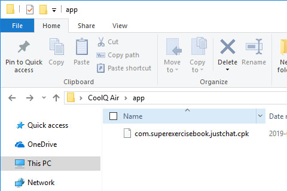

# [快速搭建](../)/机器人 - Minecraft 模式

## 特点
- 最简单的运行模式，搭建简单。
- 本运作结构针对一游戏服务器与一群互通，适合大多数的用户使用。

## 运行模式
- 我们再次看一下运行结构图，分析一下我们需要做些什么

- 我们只需要关注红色部分即可。因为黑色部分已经是被别人做好的了~

## 开始搭设
- 我们以 [Bukkit](../../install/bukkit) 与 [CoolQ](../../install/coolq) 为例。
1. 先下载好 [Bukkit](https://bukkit.org) 与 [CoolQ Air](https://cq.im/air) 备用。 
(```CoolQ Air``` 为 CoolQ 的免费版，使用付费的 [CoolQ Pro](https://cq.im/pro) 依然可以正常使用本插件)
1. 搭设酷Q机器人端
	1. 将插件cpk文件复制到酷Q插件目录
	