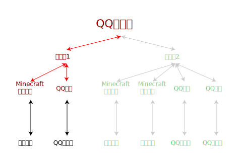

# [快速搭建](../)/机器人 - Minecraft 模式

## 特点
- 最简单的运行模式，搭建简单。
- 本运作结构针对一游戏服务器与一群互通，适合大多数的用户使用。

## 运行模式
- 我们再次看一下运行结构图，分析一下我们需要做些什么。  

- 我们只需要关注红色部分即可。因为黑色部分已经是被别人做好的了~

## 开始搭设
- 我们以 [Bukkit](../../install/bukkit/) 与 [CoolQ](../../install/coolq/) 为例。
- 在这个运行结构中。 酷Q机器人端设为JustChat服务端，Minecraft服务器端设为JustChat客户端。
### 准备工作
- 下载 [Bukkit](https://bukkit.org) 与 [CoolQ Air](https://cq.im/air) 备用。   
- `CoolQ Air` 为 CoolQ 的免费版，使用付费的 [CoolQ Pro](https://cq.im/pro) 依然可以正常使用本插件

### 搭设 [酷Q机器人端](../../install/coolq/)
1. 将cpk插件文件复制到酷Q插件目录: `app/` 。  

1. 启动酷Q并启用本插件，生成初始配置文件。  

1. 在 `data/app/com.superexercisebook.justchat/` 或 `app/com.superexercisebook.justchat/` 中找到配置文件并按照您的喜好修改。  
[配置文件格式介绍](../../install/coolq/#配置文件)  
	1. `[server]mode` 修改为 `server` 使得本插件以服务端模式运行。  
	默认: `server`
	1. `[server]ip` 修改为本插件所侦听的公网 IPv4 地址。   
	默认: `0.0.0.0`
	1. `[server]port` 修改为本插件所侦听的端口号。
	1. `[config]groupid` 修改为当前机器人所作用的QQ群群号
1. 重启 酷Q ，使得修改后的配置文件生效。

### 搭设 [Minecraft Bukkit 服务端](../../install/bukkit/)
1. 将jar插件文件复制到酷Q插件目录: `plugins/` 。  

1. 启动 Bukkit 服务端，生成初始配置文件。
1. 在 `plugins/MultiRobot/`  中找到配置文件并按照您的喜好修改。  
[配置文件格式介绍](../../install/bukkit/#配置文件)  
	1. `serverIP` 修改为 `酷Q机器人端` 所侦听的公网 IPv4 地址。
	1. `serverPort` 修改为 `酷Q机器人端` 所侦听的公网端口号。
	1. `serverName` 修改为 本 Minecraft服务端 的名字。
1. 重启 Bukkit ，使得修改后的配置文件生效。

### 搭设完成
- 开始享受愉快的聊天之旅吧~