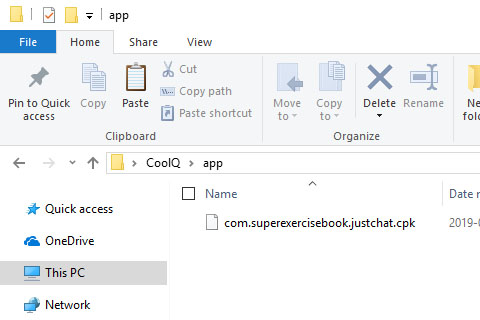

# [快速搭建](../)/机器人 - 消息转发与处理中心 - Minecraft 模式

## 特点
- 本运作结构针对多游戏服务器或多机器人互通。
- 在一个Minecraft服务器中的发言可以被其他的所有Minecraft服务器和所有的QQ群中的成员看到，在一个QQ群中的发言可以被其他的所有QQ群和所有的Minecraft服务器中的成员看到。

## 运行模式
- 我们再次看一下运行结构图，分析一下我们需要做些什么。  

- 我们只需要关注红色部分即可。因为黑色部分已经是被别人做好的了~

## 开始搭设
- 我们以 [消息转发控制中心](../../install/php/) 和 一个[Bukkit](../../install/bukkit/) 与 一个[CoolQ](../../install/coolq/) 为例。
- 在这个运行结构中。 消息转发控制中心设为JustChat服务端，其余全部设为JustChat客户端。
1. 下载 [Bukkit](https://bukkit.org) 与 [CoolQ Air](https://cq.im/air) 备用。   
(`CoolQ Air` 为 CoolQ 的免费版，使用付费的 [CoolQ Pro](https://cq.im/pro) 依然可以正常使用本插件)
1. 搭设 [消息转发控制中心](../../install/php)
	1. 我们假设您已经下载好 [php](http://www.php.net/) 并将运行环境配置完毕。
	1. 将 [消息转发控制中心](../../install/php/#配置)
1. 搭设 [酷Q机器人端](../../install/coolq)
	1. 将cpk插件文件复制到酷Q插件目录: `app/` 。  
	
	1. 启动酷Q并启用本插件，生成初始配置文件。  
	
	1. 在 `data/app/com.superexercisebook.justchat/` 或 `app/com.superexercisebook.justchat/` 中找到配置文件并按照您的喜好修改。  
	[配置文件格式介绍](../../install/coolq/#配置文件)  
		1. `[server]mode` 修改为 `client` 使得本插件以客户端模式运行。
		1. `[server]server` 修改为`消息转发控制中心`的公网 IPv4 地址。
		1. `[server]port` 修改为`消息转发控制中心`所侦听的端口号。
		1. `[server]name` 修改为本 酷Q机器人 的名字。  
		所有的 JustChat 客户端的名字**必须两两互不相同**。
		1. `[config]groupid` 修改为当前机器人所作用的QQ群群号
	1. 重启 酷Q ，使得修改后的配置文件生效。
1. 搭设 [Minecraft Bukkit 服务端](../../install/bukkit/)
	1. 将jar插件文件复制到酷Q插件目录: `plugins/` 。  
	
	1. 启动 Bukkit 服务端，生成初始配置文件。
	1. 在 `plugins/MultiRobot/`  中找到配置文件并按照您的喜好修改。  
	[配置文件格式介绍](../../install/bukkit/#配置文件)  
		1. `serverIP` 修改为 `消息转发控制中心` 所侦听的公网 IPv4 地址。
		1. `serverPort` 修改为 `消息转发控制中心` 所侦听的公网端口号。
		1. `serverName` 修改为 本 Minecraft服务端 的名字。   
		所有的 JustChat 客户端的名字**必须两两互不相同**。
	1. 重启 Bukkit ，使得修改后的配置文件生效。
1. 如果还有其他的 `酷Q服务端` 或 `Minecraft服务端` 需要搭设的话  
重复 第三步 和 第四步 ，使得所有的 `酷Q机器人端` 和 `Minecraft服务端` 都成功连接到 `消息转发与处理中心`。
1. 搭设完成。